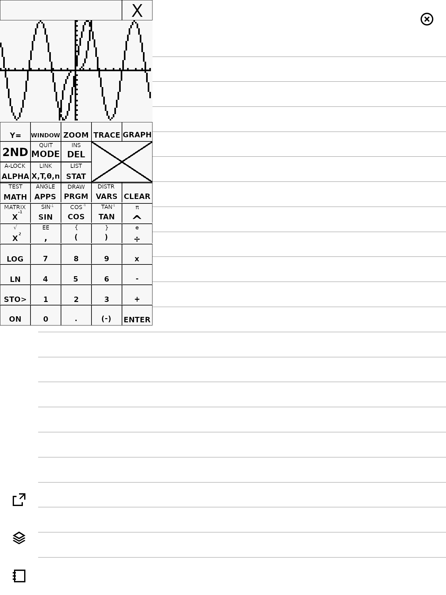

reMarkable Stuff
================
[](https://github.com/timower/rM2-stuff/actions/workflows/build.yml)
[](https://codecov.io/github/timower/rM2-stuff)

Collection of reMarkable related apps, utilities and libraries.

Projects
--------

### [rm2fb](libs/rm2fb)
[](https://support.remarkable.com/s/article/Software-release-2-15-October-2022)
[](https://support.remarkable.com/s/article/Software-release-3-3)
[](https://support.remarkable.com/s/article/Software-release-3-5)
[](https://support.remarkable.com/s/article/Software-release-3-8)
[](https://support.remarkable.com/s/article/Software-release-3-20)
[](https://support.remarkable.com/s/article/Software-release-3-22)
[](https://support.remarkable.com/s/article/Software-release-3-23)
[](https://support.remarkable.com/s/article/Software-release-3-28)


Custom implementation for [reMarkable 2 framebuffer](https://github.com/ddvk/remarkable2-framebuffer), extended to be a full display manager.
Ensures only a single client can control the display, and also handles input capturing.

Use Rocket to switch between apps, or `rm2fbctl` on the commandline:
```
rm2fbctl list
rm2fbctl switch <pid>
```
This rm2fb implementation will not work with other launchers.

Also supports a 'swtcon' mode, which allows Xochitl to use its own swtcon to drive the display.
This decouples rm2fb from the xochitl version, as no address based hooks are used.
In this mode I tested up to 3.28 beta.

For a more supported display driver use [Oxide](https://github.com/Eeems-Org/oxide) or [qtfb](https://github.com/asivery/rm-appload).

### [Yaft](apps/yaft)

A fast framebuffer terminal emulator.


To use simply execute `yaft` or `yaft <command..>`.
More usage information can be found in the yaft [Readme](apps/yaft).

### Rocket

Launcher that uses the power button to activate and switch apps.


When pressing the power button, the app drawer will be shown with a timeout of 10 seconds.
After 10 seconds the device will go to sleep, unless an app is picked before that timeout.
You can also interrupt the timeout by pressing the `[x]` button.

This allows you to switch apps without relying on gestures.

### Tilem

A TI-84+ calculator emulator for the remarkable.



To use simply execute `tilem`, a prompt for downloading a ROM file will be shown.
If you already have a ROM file, you can pass it as an argument on the command line.

### rMlib

Library for writing remarkable apps.
Includes an extensive declarative UI framework based on Flutter.

### [NixOS](nix/)

A [NixOS](https://nixos.org) module that allows soft-rebooting into NixOS. This
allows to declaratively manage your reMarkable 2 configuration.

### SWTCON

This library contains a reverse engineered software TCON, based on `libqsgepaper.so` version 3.23.0.54.
Used by rm2fb in the 'swtcon' mode, which requires no xochitl or libqsgepaper hooking.

Building
--------

Building for the remarkable can either use the [toltec toolchain](https://github.com/toltec-dev/toolchain)
or the reMarkable one:
```bash
# For toltec:
$ cmake --preset dev-toltec
# For remarkable:
$ cmake --preset dev

# To build everything:
$ cmake --build build/dev
# Or to build a specific app:
$ cmake --build build/dev --target yaft

# To create an ipk file:
$ cmake --build build/dev --target package
```

You can also build using Nix for the rm2 toolchain:
```bash
$ nix build .#dev-rm2-toolchain
```
See [NixOS](nix/) for more options.

Emulating
---------

For faster development an `EMULATE` mode is supported by rMlib. This allows
running most apps on a desktop using SDL to emulate the remarkable screen.
To enable it pass `-DEMULATE=ON` to the cmake configure command, without using
the reMarkable toolchain of course.
```bash
$ cmake --preset dev-host
$ cmake --build build/host --target yaft
$ ./build/host/apps/yaft/yaft # Should launch Yaft with an emulated screen in a separete window.
```

A full QEMU based emulator can also be built in [NixOS](nix/).
