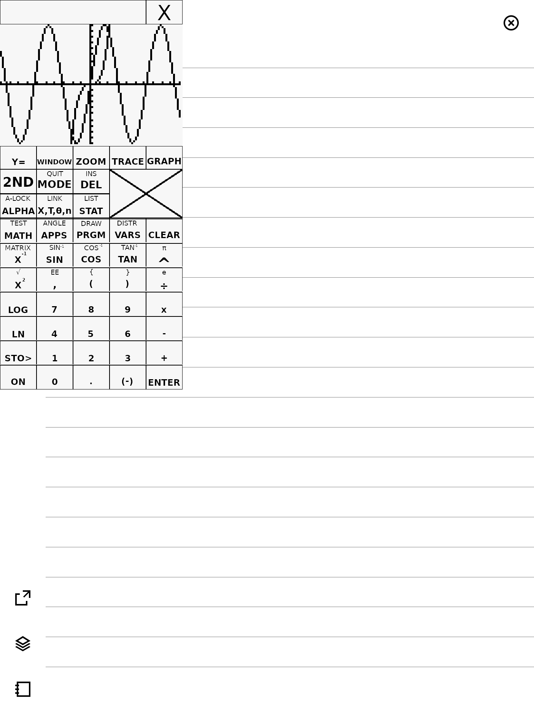

reMarkable Stuff
================

Collection of reMarkable related apps, utilities and libraries.

Projects
--------

### [Yaft](apps/yaft)

A fast framebuffer terminal emulator.


To use simply execute `yaft` or `yaft <command..>`.
More usage information can be found in the yaft [Readme](apps/yaft).

### Rocket

Launcher that uses the power button to show.


When pressing the power button, the app drawer will be shown with a timeout of 10 seconds.
After 10 seconds the device will go to sleep, unless an app is picked before that timeout.
You can also interrupt the timeout by pressing the `[x]` button.

This allows you to switch apps without relying on flaky gestures.

### Tilem

A TI-84+ calculator emulator for the remarkable.



To use simply execute `tilem`, a prompt for downloading a ROM file will be shown.
If you already have a ROM file, you can pass it as an argument on the command line.

### rMlib

Library for writing remarkable apps.
Includes an extensive declarative UI framework based on Flutter.

### rm2fb

Custom implementation for [reMarkable 2 framebuffer](https://github.com/ddvk/remarkable2-framebuffer),
latest version only tested on xochitl 3.5.
Relies on lower level hooking in order to support newer xochitl versions. Also
does not depend on the QT framework.

### SWTCON

This lib contains a reverse engineered software TCON. It currently still relies
on some functions from `xochitl`, namely the generator thread routine.
To use these functions it must be launched as an `LD_PRELOAD` library attached to xochitl.
The `swtcon-preload` tool is an example of how it can be currently used.


Building
--------

Building for the remarkable can either use the [toltec toolchain](https://github.com/toltec-dev/toolchain)
or the reMarkable one:
```lang=bash
$ mkdir build && cd build

# For toltec:
$ cmake -DCMAKE_TOOLCHAIN_FILE="/usr/share/cmake/$CHOST.cmake" ..
# For remarkable:
$ source /opt/codex/rm11x/3.1.2/environment-setup-cortexa7hf-neon-remarkable-linux-gnueabi
$ cmake ..

# To build everything:
$ cmake --build .
# Or to build a specific app:
$ cmake --build . --target yaft

# To create an ipk file:
$ cpack .
```

Emulating
---------

For faster development an `EMULATE` mode is supported by rMlib. This allows
running most apps on a desktop using SDL to emulate the remarkable screen.
To enable it pass `-DEMULATE=ON` to the cmake configure command, without using
the reMarkable toolchain of course.
```lang=bash
$ cmake -DEMULATE=ON ..
$ cmake --build . --target yaft
$ ./apps/yaft/yaft # Should launch Yaft with an emulated screen in a separete window.
```
